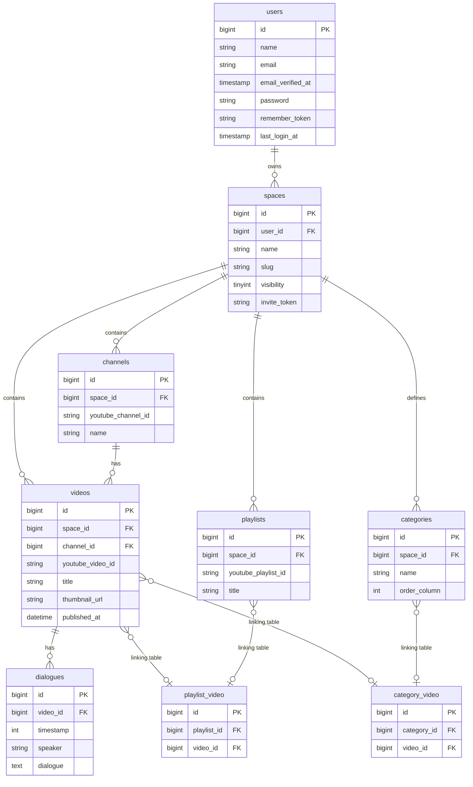

###  データベース設計図（ER図）

-----

###  各テーブルの詳細

#### **`users` テーブル**

| カラム名 | データ型 | 説明 |
| :--- | :--- | :--- |
| **id** | `bigIncrements` | **主キー(PK)**。 |
| **name** | `string` | ユーザー名。 |
| **email** | `string` | メールアドレス (`unique`)。 |
| **email\_verified\_at** | `timestamp` | メールアドレス認証日時 (`nullable`)。 |
| **password** | `string` | ハッシュ化されたパスワード。 |
| **remember\_token** | `string` | ログイン状態記憶トークン。 |
| **last\_login\_at** | `timestamp` | 最終ログイン日時 (`nullable`)。 |
| **created\_at**, **updated\_at** | `timestamp` | 作成日時, 更新日時。 |

#### **`spaces` テーブル**

| カラム名 | データ型 | 説明 |
| :--- | :--- | :--- |
| **id** | `bigIncrements` | **主キー(PK)**。 |
| **user\_id** | `foreignId` | **外部キー(FK)** (`users.id`)。所有者ID。 |
| **name** | `string` | スペースの名称。 |
| **slug** | `string` | 公開URLに使われる識別子 (`unique`)。 |
| **visibility** | `tinyInteger` | 公開範囲 (`0`:自分のみ, `1`:限定公開, `2`:全体公開)。 |
| **invite\_token** | `string` | 限定公開用のランダムな文字列 (`nullable`, `unique`)。 |
| **created\_at**, **updated\_at** | `timestamp` | 作成日時, 更新日時。 |

#### **`playlists` テーブル**

| カラム名 | データ型 | 説明 |
| :--- | :--- | :--- |
| **id** | `bigIncrements` | **主キー(PK)**。 |
| **space\_id** | `foreignId` | **外部キー(FK)** (`spaces.id`)。所属スペースID。 |
| **youtube\_playlist\_id** | `string` | YouTubeの再生リストID。 |
| **title** | `string` | 再生リストのタイトル。 |
| **created\_at**, **updated\_at** | `timestamp` | 作成日時, 更新日時。 |

#### **`categories` テーブル**

| カラム名 | データ型 | 説明 |
| :--- | :--- | :--- |
| **id** | `bigIncrements` | **主キー(PK)**。 |
| **space\_id** | `foreignId` | **外部キー(FK)** (`spaces.id`)。所属スペースID。 |
| **name** | `string` | カテゴリ名。 |
| **order\_column** | `integer` | カテゴリの並び順を管理する数値。 |
| **created\_at**, **updated\_at** | `timestamp` | 作成日時, 更新日時。 |

#### **`channels` テーブル**

| カラム名 | データ型 | 説明 |
| :--- | :--- | :--- |
| **id** | `bigIncrements` | **主キー(PK)**。 |
| **space\_id** | `foreignId` | **外部キー(FK)** (`spaces.id`)。所属スペースID。 |
| **youtube\_channel\_id** | `string` | YouTubeのチャンネルID。 |
| **name** | `string` | YouTubeチャンネル名。 |
| **created\_at**, **updated\_at** | `timestamp` | 作成日時, 更新日時。 |

#### **`videos` テーブル**

| カラム名 | データ型 | 説明 |
| :--- | :--- | :--- |
| **id** | `bigIncrements` | **主キー(PK)**。 |
| **space\_id** | `foreignId` | **外部キー(FK)** (`spaces.id`)。所属スペースID。 |
| **channel\_id** | `foreignId` | **外部キー(FK)** (`channels.id`)。所属チャンネルID。 |
| **youtube\_video\_id** | `string` | YouTubeの動画ID (`unique`)。 |
| **title** | `string` | 動画のタイトル。 |
| **thumbnail\_url** | `string` | サムネイル画像のURL。 |
| **published\_at** | `dateTime` | YouTubeでの公開日時。 |
| **created\_at**, **updated\_at** | `timestamp` | 作成日時, 更新日時。 |

#### **`dialogues` テーブル**

| カラム名 | データ型 | 説明 |
| :--- | :--- | :--- |
| **id** | `bigIncrements` | **主キー(PK)**。 |
| **video\_id** | `foreignId` | **外部キー(FK)** (`videos.id`)。所属動画ID。 |
| **timestamp** | `integer` | タイムスタンプ（秒）。 |
| **speaker** | `string` | 発言者（キャラクター名） (`nullable`)。 |
| **dialogue** | `text` | 文字起こし・文字起こしの本文。 |
| **created\_at**, **updated\_at** | `timestamp` | 作成日時, 更新日時。 |

#### **`playlist_video` テーブル (中間テーブル)**

| カラム名 | データ型 | 説明 |
| :--- | :--- | :--- |
| **id** | `bigIncrements` | **主キー(PK)**。 |
| **playlist\_id** | `foreignId` | **外部キー(FK)** (`playlists.id`)。 |
| **video\_id** | `foreignId` | **外部キー(FK)** (`videos.id`)。 |

#### **`category_video` テーブル (中間テーブル)**

| カラム名 | データ型 | 説明 |
| :--- | :--- | :--- |
| **id** | `bigIncrements` | **主キー(PK)**。 |
| **category\_id** | `foreignId` | **外部キー(FK)** (`categories.id`)。 |
| **video\_id** | `foreignId` | **外部キー(FK)** (`videos.id`)。 |
